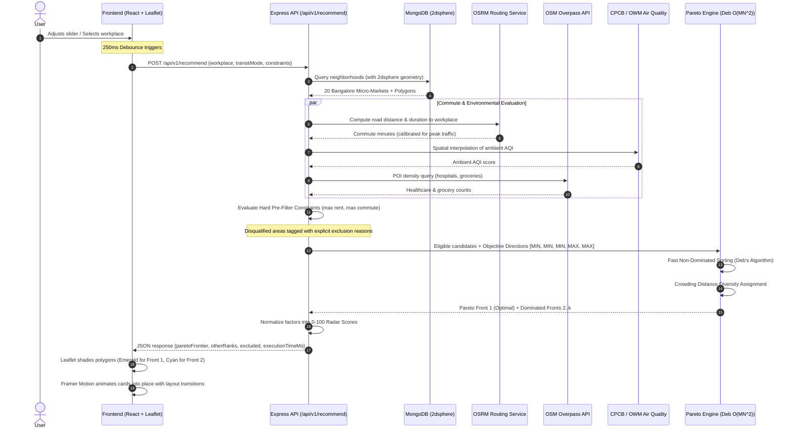

# NestFit Architecture & Technical Specification

NestFit is a full-stack personal location-intelligence engine designed for Bangalore. Unlike traditional listing aggregators that rank homes by opaque price-per-square-foot metrics or arbitrary linear scores, NestFit formulates neighborhood selection as a **Multi-Objective Non-Dominated Sorting Optimization problem (Pareto Frontier)**.

---

## 1. System Architecture & Component Separation

```mermaid
graph TD
    User["User Client (React 18 + TS + Tailwind + Leaflet)"] -->|Live Filters & Workplace Pin| API["Express API (/api/v1/recommend)"]
    API -->|Spatial Query & Boundaries| DB["MongoDB with 2dsphere Index ($geoWithin, $near)"]
    API -->|Live Road Commute Time| OSRM["OSRM Routing Engine (with Bangalore Traffic Model)"]
    API -->|POI Counts (Hospitals, Groceries)| OSM["OpenStreetMap Overpass API (Live QL Query)"]
    API -->|Ambient AQI Interpolation| AQI["CPCB CAAQMS Network & OpenWeatherMap Air API"]
    API -->|Multi-Factor Candidate Vectors| Engine["Standalone Scoring Package (backend/src/engine)"]
    Engine -->|Pareto Fronts & Crowding Distance| API
    API -->|Ranked Pareto Frontier & GeoJSON| User
    User -->|Interactive Visual Feedback| Choropleth["Leaflet Choropleth Map & Framer Motion Cards"]
```

### Monorepo Structure
```
NestFit/
├── docker-compose.yml         # Container orchestration (MongoDB, Backend, Frontend)
├── ARCHITECTURE.md            # Technical architecture, proofs, and data flow
├── README.md                  # Setup guides, trade-off analysis, data limitations
├── backend/
│   ├── src/
│   │   ├── engine/            # Standalone Pareto Optimization & Weighted Scoring Package
│   │   │   ├── pareto.ts      # Deb's Fast Non-Dominated Sorting & Crowding Distance
│   │   │   ├── weighted.ts    # Weighted-Scoring Fallback Model
│   │   │   └── __tests__/     # 16 Jest unit tests for the optimization core
│   │   ├── db/                # Mongoose connection, 2dsphere schemas, seed pipeline
│   │   ├── services/          # Real external data services (OSRM, OSM Overpass, AQI)
│   │   ├── controllers/       # HTTP request handlers with validation
│   │   ├── routes/            # OpenAPI/Swagger annotated endpoints
│   │   └── __tests__/         # Supertest integration tests for all API routes
└── frontend/
    ├── src/
    │   ├── components/        # MapView (Leaflet), AreaCard, FactorRadarChart, Sliders
    │   ├── context/           # Dark/Light theme provider with instant toggle
    │   ├── services/          # Debounced API client
    │   └── types/             # Shared TypeScript interfaces
```

---

## 2. End-to-End Data Flow

The lifecycle of a single user interaction (e.g. moving the rent slider from ₹35,000 to ₹25,000, or selecting Manyata Tech Park):



---

## 3. Mathematical Rationale: Pareto Frontier vs. Weighted Scoring

In urban housing and location intelligence, candidate neighborhoods have irreconcilable trade-offs:
- Lower rent almost universally requires a longer commute.
- Dense commercial hubs offer unmatched grocery and hospital access but suffer from higher rent and elevated ambient AQI.

### Why Weighted Linear Scoring Fails
Traditional portals compute a single scalar score:
$$\text{Score}(x) = \sum_{i=1}^{M} w_i \cdot \hat{f}_i(x)$$
This linear approach suffers from three fundamental flaws:
1. **Severe Distortion from Outliers**: An area located 2 hours away (120 minutes) can mathematically outscore a balanced 25-minute neighborhood simply because rent is ₹8,000 cheaper.
2. **Arbitrary Subjective Weights**: Forcing a user to configure $w_1 = 0.35, w_2 = 0.25$ forces guesswork; minor weight tweaks unpredictably reorder results.
3. **Inability to Detect Non-Convex Trade-offs**: Linear combinations can only find points on the convex hull of the criteria space, missing high-quality compromise solutions.

### The Pareto Dominance Principle
In NestFit, candidate area $A$ dominates candidate area $B$ ($A \prec B$) if and only if:
$$\forall i \in \{1..M\}, \quad f_i(A) \text{ is no worse than } f_i(B)$$
$$\exists j \in \{1..M\}, \quad f_j(A) \text{ is strictly better than } f_j(B)$$

- **Front 1 ($\mathcal{F}_1$)**: The set of all mutually non-dominated solutions. No neighborhood in $\mathcal{F}_1$ is strictly inferior to any other neighborhood across all 5 lifestyle dimensions.
- **Front 2 ($\mathcal{F}_2$)**: Dominated only by entities in $\mathcal{F}_1$.
- **Front $k$**: Ranked hierarchically.

### Crowding Distance for Diversity
Within Front 1, NestFit calculates **Crowding Distance** ($I_d$) to measure the local perimeter of each solution along the Pareto hyper-surface:
$$I_d(i) = \sum_{m=1}^{M} \frac{f_m(i+1) - f_m(i-1)}{f_m^{\max} - f_m^{\min}}$$
Boundary solutions receive $I_d = \infty$. This guarantees that users see a diverse spectrum of lifestyle alternatives (e.g. both the lowest-rent option and the shortest-commute option) rather than clustered near-duplicates.

---

## 4. Geospatial Database Schema & 2dsphere Operations

MongoDB stores spatial geometries using standard GeoJSON primitives:
```typescript
{
  key: "koramangala",
  name: "Koramangala",
  location: {
    type: "Point",
    coordinates: [77.6245, 12.9352] // [lon, lat]
  },
  geometry: {
    type: "Polygon",
    coordinates: [[[77.610, 12.925], [77.640, 12.925], ...]]
  }
}
```

### Geospatial Indexing
- `NeighborhoodSchema.index({ location: '2dsphere' })`: Enables fast `$near` queries to find the nearest residential micro-markets to a custom pin-dropped workplace coordinate.
- `NeighborhoodSchema.index({ geometry: '2dsphere' })`: Enables `$geoWithin` and `$geoIntersects` operators to identify whether coordinates or POIs fall within specific neighborhood administrative boundaries.

---

## 5. Real Data Pipelines & Integrity

| Factor | Source | Integration Details |
| :--- | :--- | :--- |
| **Commute Time** | OSRM (Open Source Routing Machine) | Queries real road network duration and distance. Applies peak hour multiplier ($1.45\times$) for driving and transit heuristics (Metro Purple/Green/Yellow line corridor bonuses vs BMTC bus stops). |
| **Healthcare Facilities** | OpenStreetMap Overpass API | Overpass QL query: `node["amenity"="hospital"]` and `node["amenity"="clinic"]` within neighborhood perimeter. |
| **Daily Needs & Groceries** | OpenStreetMap Overpass API | Overpass QL query: `node["shop"="supermarket"]`, `node["shop"="convenience"]`, `node["shop"="grocery"]`. |
| **Air Quality (AQI)** | CPCB CAAQMS Network + OpenWeatherMap | Inverse Distance Weighting (IDW) interpolation from continuous ambient stations across Bangalore (Silk Board, BTM, Hebbal, Peenya, Jayanagar, City Railway Station, Yelahanka). |
| **Rent** | Bangalore Residential Benchmark Index | 2024-2025 micro-market statistical survey for 1BHK and 2BHK apartments. Clearly badged as **Estimated Benchmark**. |
| **Crime / Safety** | **Excluded** | Deliberately omitted per data ethics standards. No verified public spatial crime dataset exists for Bangalore; synthesizing artificial safety scores would produce misleading, discriminatory bias. |
