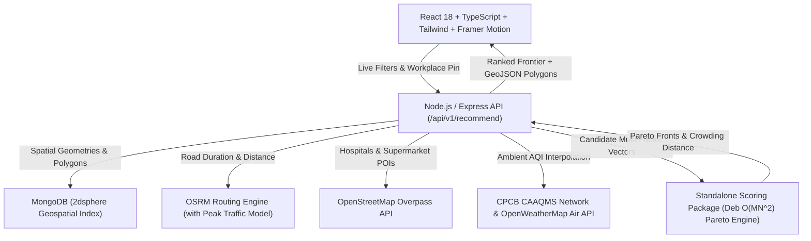

# NestFit — Personal Location-Intelligence Engine for Bangalore

> **Find where you fit in a city, not just where you rent.**

NestFit is a full-stack personal location-intelligence web application that evaluates neighborhoods in Bangalore across real-time multi-factor suitability (Rent, Commute Time, Air Quality, Healthcare Access, Daily Needs Density) and computes the **Pareto-optimal set of areas (Non-Dominated Sorting)** given the user's constraints.

---

## 🌟 Key Features

- **Pareto-Optimal Matching (Non-Dominated Sorting)**: Mathematically computes the trade-off frontier between conflicting life factors rather than collapsing choices into an opaque single score.
- **Weighted-Scoring Fallback Comparison**: Interactive toggle between the Pareto Frontier and traditional Linear Weighted Scoring to directly observe the trade-offs.
- **Interactive Leaflet Choropleth Map**: Neighborhood boundaries shaded dynamically by Pareto rank (Emerald for Front 1, Cyan for Front 2, Violet for Front 3+, Slate for Excluded).
- **Bangalore Tech Park Quick Presets**: One-click selection of major hubs (Manyata Embassy Park, RMZ Ecospace ORR, ITPL Whitefield, Electronic City, Bagmane Tech Park, Embassy Golf Links, World Trade Center).
- **Multi-Modal Commute Engine**: Powered by the Open Source Routing Machine (OSRM) with Bangalore traffic calibration and Namma Metro corridor bonuses.
- **Factor Radar Charts**: Interactive SVG radar visualization breaking down Affordability, Commute Convenience, Air Quality, Healthcare, and Daily Needs for every micro-market.
- **Framer Motion Live Layout Transitions**: Area cards smoothly animate in and out as constraints change without page reloads.
- **Dark-Mode First Design**: Modern, startup-grade visual aesthetic with glassmorphism and a seamless light-mode switch.

---

## 📐 Architecture Diagram



---

## 💡 Why Pareto Frontier Over Simple Weighted Scoring?

Traditional real estate portals rank areas by computing a single weighted sum:
$$\text{Score} = w_1 \cdot \text{Rent} + w_2 \cdot \text{Commute} + w_3 \cdot \text{AQI} + \dots$$

### The Flaws of Weighted Scoring:
1. **Severe Outlier Concealment**: An area with an unbearable 90-minute commute can rank #1 simply because rent is ₹8,000 cheaper.
2. **Subjective Weight Burden**: Forcing users to configure numerical weights (e.g. $w_{\text{rent}} = 0.35, w_{\text{commute}} = 0.25$) is unintuitive and minor slider adjustments unpredictably disrupt the ranking.
3. **Loss of Optimal Trade-offs**: Weighted sums can only find points on the convex hull of the criteria space, failing to detect balanced non-convex compromises.

### The Pareto Non-Dominated Sorting Solution:
A neighborhood $A$ dominates neighborhood $B$ ($A \prec B$) if and only if:
1. $A$ is no worse than $B$ across **all** 5 factors.
2. $A$ is strictly better than $B$ in at least **one** factor.

**Front 1 (The True Pareto Frontier)** comprises all neighborhoods for which no alternative is strictly superior in every category. Every solution on Front 1 represents a mathematically optimal, irreplaceable life decision. NestFit uses **Crowding Distance Sorting** within Front 1 to present a diverse array of lifestyle alternatives.

---

## 🚀 Quickstart Guide

### Option 1: Run Locally (Fastest)

#### Prerequisites
- **Node.js** (v18+ or v20+)
- **npm** (v9+)

#### 1. Setup Backend
```bash
cd backend
npm install
npm run build
npm test # Runs all 24 Jest unit & integration tests
npm start # Starts Express on http://localhost:5000
```
> *Note:* The backend features a dual-mode database layer. If MongoDB is running on `localhost:27017`, it automatically connects and seeds the 2dsphere collections. If MongoDB is not running, it transparently falls back to the embedded high-fidelity Bangalore spatial dataset, so the entire app works immediately out of the box!

#### 2. Setup Frontend
In a separate terminal:
```bash
cd frontend
npm install
npm run dev # Starts Vite on http://localhost:3000
```
Visit `http://localhost:3000` in your browser.

---

### Option 2: Run via Docker Compose

```bash
docker-compose up --build
```
- **Frontend**: `http://localhost:3000`
- **Backend API**: `http://localhost:5000`
- **Swagger Documentation**: `http://localhost:5000/api-docs`
- **MongoDB**: `localhost:27017`

---

## 🧪 Testing Suite

NestFit includes extensive unit tests for the optimization engine and integration tests for the API routes:

```bash
cd backend
npm test
```

### Test Coverage Highlights:
- **`src/engine/__tests__/pareto.test.ts`**:
  - Dominance logic across minimization and maximization criteria
  - Deb's Fast Non-Dominated Sort algorithm on 2D and 5D NestFit vectors
  - Crowding distance calculations and boundary conditions
  - Edge cases (empty candidates, single candidate, identical duplicates)
- **`src/engine/__tests__/weighted.test.ts`**:
  - Linear composite score calculations (0-100 range)
  - Weight sensitivity and trade-off commentary
- **`src/__tests__/api.test.ts`**:
  - Full HTTP integration tests for `/health`, `/api/v1/meta/workplaces`, `/api/v1/meta/factors`, `/api/v1/neighborhoods`, and `/api/v1/recommend`

---

## 📊 Data Sources & Known Limitations

| Factor | Source | Methodology & Limitations |
| :--- | :--- | :--- |
| **Commute Time** | OSRM (Open Source Routing Machine) | Computes real driving road duration and distance. Applies peak hour multiplier ($1.45\times$) for driving and transit heuristics (Metro Purple/Green/Yellow line corridor bonuses vs BMTC bus stops). |
| **Healthcare Facilities** | OpenStreetMap Overpass API | Queries `amenity=hospital` and `amenity=clinic` within neighborhood boundary. Mapped entities reflect OpenStreetMap community contributions. |
| **Daily Needs & Groceries** | OpenStreetMap Overpass API | Queries `shop=supermarket`, `shop=convenience`, `shop=grocery` within neighborhood boundary. |
| **Air Quality (AQI)** | CPCB CAAQMS Network + OpenWeatherMap | Inverse Distance Weighting (IDW) interpolation from continuous ambient air stations across Bangalore (Silk Board, BTM, Hebbal, Peenya, Jayanagar, City Railway Station, Yelahanka). |
| **Rent** | Bangalore Residential Benchmark Index | 2024-2025 micro-market statistical survey for 1BHK and 2BHK apartments. Clearly badged as **Estimated Benchmark**. |
| **Crime / Safety** | **Excluded** | Deliberately omitted per data ethics standards. No verified public spatial crime dataset exists for Bangalore; synthesizing artificial safety scores would produce misleading, discriminatory bias. |

---

## 🛠️ API Reference (Swagger OpenAPI)

Interactive Swagger UI is available at `http://localhost:5000/api-docs`.

### Primary Endpoints:
- `POST /api/v1/recommend`: Runs multi-factor Pareto optimization or weighted scoring given user constraints.
- `GET /api/v1/meta/cities`: Supported tech cities (Bangalore & Pune) with centroids, zoom, and CAAQMS station counts.
- `GET /api/v1/meta/workplaces?city={city}`: Tech parks and major employer campuses for Bangalore (7) and Pune (6).
- `GET /api/v1/neighborhoods?city={city}`: Micro-markets with GeoJSON boundary polygons (20 Bangalore + 16 Pune).
- `GET /api/v1/neighborhoods/:key`: Detailed profile for a specific neighborhood.
- `POST /api/v1/recommend`: Multi-factor Pareto optimization and weighted-sum fallback.
- `GET /api/v1/meta/factors`: Factor definitions, units, optimization directions, and data limitation disclosures.
- `GET /api-docs`: Live interactive Swagger UI specification with OpenAPI 3.0.
- `GET /health`: Service health and database connectivity status.

---

## 🎨 UI & Experience Highlights
- **Two-Screen Architecture**: Marketing Landing Page (`/`) with Hero particles, value proposition, interactive radar demo, and "How It Works" 3-step Pareto explanation; Location-Intelligence Dashboard (`/app`) with live split-view filtering and choropleth Leaflet map.
- **Zero-Watermark Free Map Tiles**: Esri World Dark & Light Gray Canvas basemaps rendered seamlessly via Leaflet without API key restrictions or watermarks.
- **Framer Motion Animations**: Staggered card load entrances, smooth `layout` transitions on constraint recalculation, and animated counter numbers for rent, commute, and AQI stats.
- **Compare Mode**: Side-by-side comparison of 2–3 neighborhoods with delta difference highlights and superimposed multi-polygon radar chart overlay.
- **Client-Side Saved Favorites**: Persistent bookmarking backed by `localStorage` with a dedicated "Saved" filter tab.
- **Shareable Filter Links**: URL query parameter synchronization (`?city=...&wp=...&rent=...&commute=...&compare=true`) enabling instant state sharing.
- **4-Step Onboarding Walkthrough**: Guided modal explaining Non-Dominated Sorting vs arbitrary linear weights.

---

## 📄 License
MIT © NestFit Core Engineering Team.
